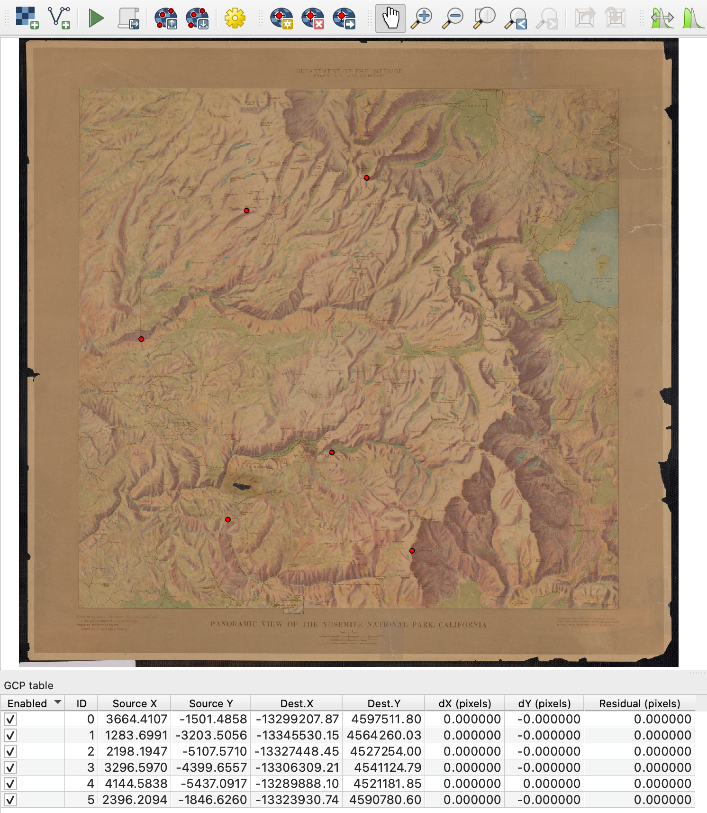

# 3D Modeling with a Scanned Shaded Relief Map
Adding three dimensionality to a classic shaded relief map of Yosemite National Park

The [BTAA Geoportal](https://geo.btaa.org/) has a wealth of interesting and beautiful historic scanned maps available to the public to download. Recently, I discovered John Henry Renshawe's shaded relief maps of US national parks from the early 1900s. Using his [Panoramic View of the Yosemite National Park, California](https://geo.btaa.org/catalog/p16022coll230:2495) from 1914, I wanted to demonstrate an open-source technique for adding three dimensionality to these fantastic relief maps.


## Download and Georeference the JPG File

The first step is to download the map [here](https://geo.btaa.org/catalog/p16022coll230:2495) and load it into a georeferencer tool in your favorite GIS software. While I find georeferencing in ArcGIS Pro to be an intuitive breeze, I used the Georeferencer tool in QGIS to keep with an open-source and MacOS-oriented workflow. You can do a lot of amazing GIS work in the comfort of your home with a MacBook!



As shown in the screenshot above, I rubbersheeted the scanned Yosemite map by locating a series of six control points shared between the scanned map in the Georeferencer and the Esri Topo World basemap in the QGIS map window. If you are lucky, the map you wish to georeference will have latitude and longitude lines, and you can enter more accurate coordinates for your points at their intersections. However, in this case, I had to locate a few prominent shared features. For my transformation settings, I used a thin plate spline transformation type and a cubic spline resampling method. I find these settings best for older maps, especially when the projection is unknown.

## Download Raster Elevation Data, Merge, and Clip

Next, you will need some raster elevation data at an appropriate resolution for the area of interest. This will be used to generate the three dimensional terrain used to warp the shaded relief map. I downloaded two hgt files from a collection called ["NASA Shuttle Radar Topography Mission Global 1 arc second V003"](https://search.earthdata.nasa.gov/search/granules?p=C2763266360-LPCLOUD&pg[0][v]=f&pg[0][gsk]=-start_date&sb[0]=-119.70264%2C37.47469%2C-119.1709%2C38.2173&tl=1731453010.335!3!!&lat=37.82208275504045&long=-121.453857421875&zoom=7) at NASA's [Earthdata Search](https://search.earthdata.nasa.gov/search) as shown in the image below.


Then, drag and drop the two raster hgt files into QGIS. You will need to stitch these two files together using the Merge tool, located at Raster > Miscellaneous > Merge within the dropdown options at the top. The merged image will exceed the extent of the shaded relief map, but you can clip the result by creating and using a mask layer. Choose Layer > Create Layer > New Shapefile Layer from the dropdown options at the top and trace the border of the mapped region, as shown below.


Now, Open Raster > Extraction > Clip Raster by Mask Layer. Enter the merged elevation raster as the input layer and the newly created shapefile as the mask layer. Run the tool. The result should look something like the following screenshot. You may notice a black edge in the output elevation raster overlapping the frame bordering the map. This is fine because these cells carry an elevation value of 0 and this part of the resulting three dimensional map will remain flat.


## Define a Color and Elevation Range and Create an RGB.tif

You will need to convert the elevation raster to a colorized tif file. This is not difficult, but it does require you to have gdal installed. If you do not have this installed, you can use [Homebrew on a Mac to do so](https://formulae.brew.sh/formula/gdal) by pasting and execulting the following command in Terminal:

```
brew install gdal
```

Next, in Terminal, cd to the folder containing your clipped raster elevation file and create a txt file called color_relief.txt with the following command:

```
touch color_relief.txt
```

Now, open up this file and enter the following text:

```
0 68 1 84
3988 253 231 37
```

Here you will see the initial numeric values of 0 and 3988. This is the full range of elevation contained in the raster in meters. To the right of these two values are three additional numbers. These are the RGB values that define the beginning and end of the color range applied to the raster. I cannot say the reason why, but processing the raster in this way will lead to a smooth end result with no spikes or cave-ins in the three dimensional terrain. Please let me know if you know why this is the case!

Finally, you need to return to Terminal to run the following gdaldem command on your clipped elevation raster. Make sure you cd to the path of the folder holding your raster and change "input_dem.tif" and "output_rgb.tif" to the names of your own files.

```
gdaldem color-relief input_dem.tif color_relief.txt output_rgb.tif
```

If you executed the command correctly, you should see an output file that looks like the image below.

